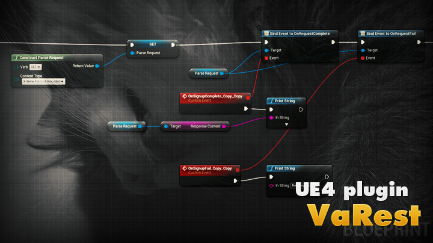

Overview
========

VaRest is the plugin for [Unreal Engine 4](https://www.unrealengine.com/) that makes REST server communications easier to use.

Key features:

* Flexible Http/Https request management with support of different Verbs and Content Types
* **No C++ coding required**, everything can be managed via blueprints
* Blueprintable FJsonObject wrapper with almost full support of Json features: different types of values, **arrays**, **binary data** content, both ways serializarion to FString, etc.
* Blueprintable FJsonValue wrapper - **full Json features made for blueprints!**
* Both bindable events and **latent functions** are provided to control the asynchronous requests
* [Parse](https://parse.com) REST API manager to start working with Parse out of the box!

Check the [Wiki](https://github.com/ufna/VaRest/wiki) tab for plugin usage examples and installation notes.

Current version: **1.1 R 12** (UE 4.8-4.10)

Legal info
----------

Unreal® is a trademark or registered trademark of Epic Games, Inc. in the United States of America and elsewhere.

Unreal® Engine, Copyright 1998 – 2014, Epic Games, Inc. All rights reserved.

